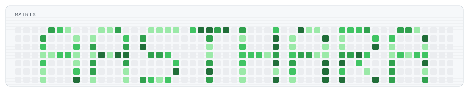

<p align="center">
  
</p>

<h1 align="center">Hi 👋, I'm Aastha Rai</h1>

<h3 align="center">
  AI/ML Engineer • Full-Stack Developer • Building Intelligent Systems
</h3>

<p align="center">
  Designing and shipping AI-powered applications — RAG systems, NLP pipelines & full-stack web apps — with Python, React & Next.js 🚀
</p>

<p align="center">
  
</p>

<p align="center">
  <a href="https://github.com/AasthaRai0">
    
  </a>
  <a href="www.linkedin.com/in/aastha-rai-0317a6327">
    
  </a>
  <a href="https://leetcode.com/u/aastharai2906">
    
  </a>
  <a href="mailto:aastharai4214@gmail.com">
    
  </a>
</p>

<p align="center">
  
</p>

---

## 👩‍💻 About Me

```python
class AasthaRai:
    def __init__(self):
        self.role = "AI/ML Engineer & Full-Stack Developer"
        self.education = "B.Tech AI @ DSEU (2024–28), CGPA: 8.96"
        self.focus = ["RAG Pipelines", "NLP", "GenAI Applications", "Full-Stack Dev"]
        self.currently_building = "AI-powered products that solve real problems"
        self.fun_fact = "I let my models overfit on curiosity, not just data 😄"

    def say_hi(self):
        return "Let's build something intelligent together!"
```

- 🎓 B.Tech Artificial Intelligence student at **Delhi Skill and Entrepreneurship University**
- 🤖 Focused on **Machine Learning, NLP, and GenAI application development**
- 💻 Building end-to-end AI systems — from data pipelines to deployed full-stack apps
- 🌐 Comfortable across the stack: **Python (ML/NLP) + React/Next.js/Node (Web)**
- 🧠 Consistent **DSA / LeetCode** practice to sharpen problem-solving fundamentals
- 🏆 Hackathon winner — placed at **Delhi AI Grind** and **Cyphothon**
- 🌱 Currently deepening my skills in **LangChain, vector search, and applied deep learning**

---

## ⚒️ Tech Stack

### 👨‍💻 Programming Languages

<p align="left">
  
</p>

### 🤖 AI / Machine Learning

<p align="left">
  
  
  
  
  
  
  
</p>

### 🌐 Full-Stack Development

<p align="left">
  
</p>

### 🛠️ Tools & Technologies

<p align="left">
  
</p>

---

## 🚀 Featured Projects

<table>
<tr>
<td width="50%" valign="top">

### 🔹 [AI Research Assistant — RAG System](https://github.com/AasthaRai0)
Full-stack AI app enabling natural-language Q&A over uploaded PDFs using Retrieval-Augmented Generation.

**Tech:** React, FastAPI, PostgreSQL, ChromaDB, LangChain

</td>
<td width="50%" valign="top">

### 🔹 [DEBTRIX — AI Debt Optimizer](https://github.com/AasthaRai0)
AI-powered fintech platform generating personalized debt repayment strategies (Snowball vs. Avalanche) with real-time analytics.

**Tech:** React, TypeScript, Node.js, MongoDB, Gemini API

</td>
</tr>
<tr>
<td width="50%" valign="top">

### 🔹 [Smart Clause Classifier](https://github.com/AasthaRai0)
ML-powered legal tech system that automates classification and risk detection of contract clauses using NLP.

**Tech:** Python, Scikit-learn, TF-IDF, NLP

</td>
<td width="50%" valign="top">

### 🔹 [FairLens — AI Fairness SaaS](https://github.com/AasthaRai0)
ML fairness auditing platform that analyzes datasets and visualizes bias metrics.

**Tech:** Python, FastAPI, Machine Learning

</td>
</tr>
</table>

<details>
<summary>📦 More Projects</summary>
<br>

**UNBLOCK AI** — AI-powered multi-party payment deadlock resolution system that identifies payment failures and suggests recovery actions.
**Tech:** React, Node.js, PostgreSQL, AI

</details>

---

## 🏆 Achievements & Certifications

| Achievement | Details |
|---|---|
| 🥇 District Level Winner | Delhi AI Grind |
| 🥈 2nd Place Winner | Cyphothon |
| 🌟 Supercontributor | Hacktoberfest 2025 |
| 📊 Certified | Excel & Power BI — Dell Technologies |

---

## 📊 GitHub Stats

<p align="center">
  
</p>

---

<h2 align="left">🕹️ My Coding Arcade</h2>

<p align="center">
  <picture>
    <source
      media="(prefers-color-scheme: dark)"
      srcset="./dist/readme-arcade-dark.svg"
    />
    <source
      media="(prefers-color-scheme: light)"
      srcset="./dist/readme-arcade.svg"
    />
    
  </picture>
</p>

---

## 📫 Connect With Me

<p align="center">
  <a href="mailto:aastharai4214@gmail.com">
    
  </a>
  <a href="https://github.com/AasthaRai0">
    
  </a>
  <a href="www.linkedin.com/in/aastha-rai-0317a6327">
    
  </a>
  <a href="https://leetcode.com/aastharai2906">
    
  </a>
</p>

<p align="center">
  ✨ Not just prompting AI — building it. ✨
</p>
